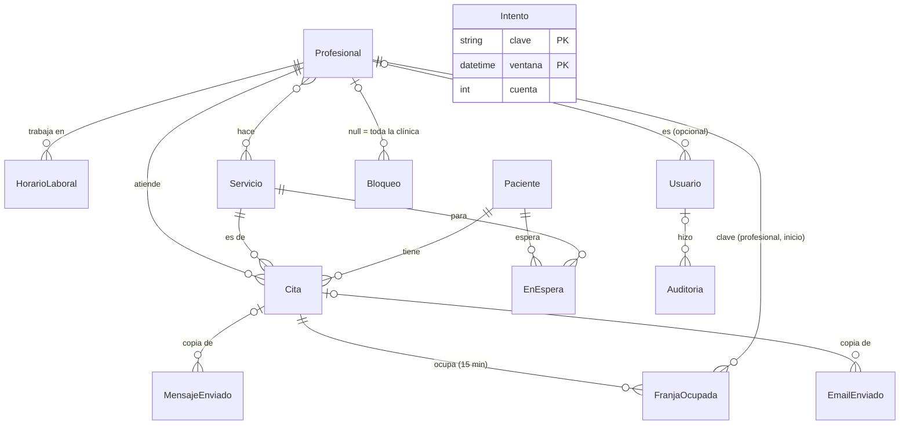

# Arquitectura

Cómo está hecho y por qué. Cada decisión de aquí tiene un test que la sostiene; la lista está en [Pruebas](pruebas.md).

## Dónde está cada cosa

```
prisma/schema.prisma          modelo de datos
prisma/seed.ts                CLI del seed
src/lib/disponibilidad.ts     cálculo de huecos y solapes (función pura, con tests)
src/lib/reservas.ts           huecos con datos reales, crear, mover y cancelar citas
src/lib/pacientes.ts          normalización del nombre (identidad y búsqueda)
src/lib/auth.ts               Auth.js, usuario de la petición y roles
src/lib/permisos.ts           quién puede modificar las citas y bloqueos de quién
src/lib/acceso.ts             enlaces de un solo uso para poner contraseña
src/lib/limite.ts             límite de intentos
src/lib/auditoria.ts          registro de actividad
src/lib/retencion.ts          plazos de conservación (cron diario)
src/lib/estadisticas.ts       números del panel de estadísticas
src/lib/importar.ts           lectura del CSV de pacientes (codificación, separador, columnas)
src/lib/migraciones.ts        ejecutor de migraciones (build, seed y CLI)
src/lib/clinica.ts            datos de la clínica (variables CLINICA_*) y MODO_DEMO
src/lib/horario.ts            horario público, calculado de los horarios de los profesionales
src/lib/seed-datos.ts         datos de la demo (los usa el seed y el cron de reinicio)
src/lib/emails/               plantillas y envío (Resend o consola)
src/lib/mensajes.ts           WhatsApp y SMS con Twilio (o consola), webhook de estado y su firma
src/lib/fechas.ts             utilidades de fecha en Europe/Madrid
src/app/(publica)/            web, /reservar y /cita/[token]
src/app/panel/acciones/       acciones de servidor, por área: citas, pacientes, bloqueos, configuración, usuarios y sesión
src/app/panel/                login, recuperación y panel (agenda, citas, pacientes, bloqueos, emails, configuración, usuarios)
src/app/api/cron/             recordatorios y reinicio de la demo
src/app/api/twilio/estado/    webhook: si un WhatsApp no llega, sale el SMS
src/app/api/resend/webhook/   webhook: rebotes y quejas de spam
src/app/api/salud/            para el monitor de disponibilidad
src/instrumentation.ts        errores del servidor → log y email de alerta
e2e/                          pruebas de extremo a extremo (Playwright), con auditoría de accesibilidad (axe)
scripts/capturas.mjs          capturas de todas las pantallas
.github/workflows/ci.yml      lint, tests y e2e en cada push
.github/dependabot.yml        actualizaciones semanales agrupadas
next.config.ts                cabeceras de seguridad (CSP, HSTS…)
```

## Modelo de datos



- **Cita** guarda, además de sus relaciones, una foto de lo que se escribió al reservar (nombre, teléfono, email), el precio que tenía el servicio (`precioCent`) y el cobro (`pagadaAt`, `formaPago`, `cobradoCent`).
- **FranjaOcupada** es lo que impide las dobles reservas: una fila por cada 15 minutos de cada cita activa.
- **Paciente** es único por `(telefono, nombreNorm)`; `eliminadoAt` marca las fichas anonimizadas.
- **Usuario** lleva el rol (`ADMIN` o `EQUIPO`), si es de la demo, el enlace de acceso de un solo uso (solo su hash) y `sesionesDesde`.
- **Auditoria** e **Intento** no cuelgan de nadie a propósito: el registro de actividad sobrevive al borrado de lo que describe, y el límite de intentos va por clave.

El esquema completo, comentado, está en [`prisma/schema.prisma`](../prisma/schema.prisma).

## Dobles reservas

SQLite no tiene restricciones de exclusión por rango, así que cada cita activa ocupa filas en `franjas_ocupadas`, una por cada 15 minutos, con clave primaria `(profesionalId, inicio)`. La cita y sus franjas se insertan en una única transacción: si dos personas confirman a la vez horas que se pisan, la segunda viola la clave primaria y no se guarda nada. Al cancelar se borran las franjas y el hueco vuelve a ofrecerse. Con «me da igual», si el primer profesional acaba de ocuparse se intenta con el siguiente. Mover una cita (formulario o arrastre) libera las franjas viejas y ocupa las nuevas en una sola transacción: si el destino está pillado, la cita se queda donde estaba. Esa transacción vuelve a exigir que la cita siga confirmada: si el paciente la cancela mientras recepción la mueve, gana la cancelación y no queda ningún hueco ocupado por una cita cancelada.

## Pacientes

Un paciente es un teléfono más un nombre normalizado (sin acentos ni mayúsculas), con restricción única en la base de datos. El mismo móvil con otro nombre es otro paciente: es el caso de quien reserva para su hijo. Como a quien reserva por la web no se le verifica nada, una reserva web solo rellena el email de la ficha si faltaba; cambiarlo es cosa de recepción. La cita se enlaza a su paciente con `connectOrCreate` dentro de la misma transacción que ocupa las franjas, y conserva además lo que se escribió al reservar. La migración que introdujo la tabla crea los pacientes de las citas que ya existían, con una normalización en SQL que es más corta que la del código: solo quita las tildes del español y no junta espacios dobles. Una base de datos que ya tuviera citas a nombre de «Jordi Pàmies» le habría hecho una ficha que su siguiente reserva no encuentra, y saldría duplicada (para eso está la fusión). No afecta a ninguna instalación nueva, y la migración no se toca porque ya está aplicada: Prisma compara su huella. Si alguien reserva una vez como «Pepe» y otra como «José» salen dos fichas: la ficha avisa de las que comparten teléfono o nombre y recepción puede fusionarlas (las citas, la lista de espera y el historial de accesos pasan a la que se queda). Solo se fusiona entre esos posibles duplicados, para que un despiste no mezcle a dos desconocidos. También hay alta a mano, sin cita.

## Importar pacientes

CSV y no `.xlsx` a propósito: leer Excel exige una librería (la de npm más conocida está abandonada y con avisos de seguridad) y desde Excel es «Guardar como → CSV». A cambio, el lector se ocupa de lo que de verdad rompe estas importaciones: el Excel español separa con punto y coma y guarda en Windows-1252, no en UTF-8, así que se prueba UTF-8 estricto y, si los bytes no lo son, se lee como Windows-1252 (tildes y eñes intactas en los dos casos). Las columnas se reconocen por su nombre (Nombre, Apellidos, Teléfono o Móvil, Email o Correo, Notas u Observaciones). Va en dos pasos: comprobar, que no escribe nada y lista las filas con problemas con su número de línea, y confirmar. Las filas confirmadas vuelven del navegador, así que el servidor las valida otra vez con el mismo esquema que el resto de la app. La identidad es la de siempre (teléfono + nombre normalizado): repetir la importación no duplica a nadie.

## Usuarios, roles y contraseñas

Dos roles: `EQUIPO` (agenda, citas, pacientes, bloqueos, emails) y `ADMIN` (además, configuración, usuarios, estadísticas y actividad). Ser profesional no es un rol: es estar ligado a un profesional. Todos ven la agenda entera, pero quien es de Equipo y está ligado a un profesional solo **modifica** sus propias citas y bloqueos (`src/lib/permisos.ts`); recepción, que no está ligada a nadie, y administración gestionan lo de todos. La regla se comprueba en cada acción del servidor, no solo escondiendo botones. La cookie de sesión solo lleva el id; el rol se lee de la base de datos en cada petición (una consulta, con `cache()` de React), así que borrar a alguien o quitarle el rol surte efecto al momento y no cuando caduque la sesión.

Cambiar la contraseña (desde «Mi cuenta» o por enlace) cierra todas las sesiones de ese usuario: el login guarda su hora en la cookie y `Usuario.sesionesDesde` marca desde cuándo valen. No se usa el `iat` del JWT porque Auth.js lo renueva en cada visita.

Las contraseñas solo las escribe su dueño. Dar de alta a alguien le envía un enlace de un solo uso (3 días); «he olvidado mi contraseña» envía otro (1 hora) y responde lo mismo exista o no el email. En la base de datos solo está el hash SHA-256 del token, y cuando el email sale de verdad por Resend el enlace se tacha del registro de `/panel/emails`. Sin Resend se deja, porque ese registro es la única forma de leer el email: así se puede probar en la demo. Por eso los emails de acceso (y las alertas técnicas, que llevan trazas) solo los ve administración en «Emails y mensajes»: con ese enlace se pone la contraseña de la cuenta.

En la demo no sale nada de verdad aunque haya claves de Resend o Twilio: con las contraseñas a la vista, cualquiera enviaría emails y SMS con la marca de la clínica. Y en producción la app no arranca con los secretos de ejemplo de `.env.example`.

En la demo, los cuatro usuarios sembrados llevan `demo = true` y no se pueden cambiar, borrar ni recuperar, para que un visitante no deje fuera a los demás. Los usuarios que cree un visitante sí, y desaparecen con el reinicio nocturno.

## Estadísticas

- **Los ingresos no se mueven al cambiar tarifas**: cada cita guarda el precio que tenía el servicio al reservar (`Cita.precioCent`). Solo cuentan las citas atendidas. Al lado va lo **cobrado** de verdad (`Cita.cobradoCent`, que puede llevar descuento) y lo atendido que sigue sin cobrar.
- **Ocupación** = minutos citados / minutos disponibles, donde lo disponible es el horario de cada profesional menos los bloqueos, contado por franjas de 15 minutos como la reserva (así dos bloqueos que se pisan no restan dos veces). Se calcula con el horario de hoy: si alguien cambió de horario a mitad de un mes pasado, la ocupación de ese mes es aproximada.
- **Ausencias** = no presentadas sobre las que debían haberse atendido; las canceladas a tiempo van aparte, porque liberaron el hueco.
- Los gráficos son HTML y CSS, sin librería: una sola serie en el cobalto del sitio con el mes elegido destacado sobre gris, cifra solo en el mes elegido y en el mejor, burbuja al pasar el ratón o con el foco del teclado, texto alternativo en cada marca y una tabla equivalente debajo de cada gráfico. Las variaciones llevan flecha y texto además de color.

## Recordatorios al móvil

El cron de recordatorios avisa al móvil de todos los pacientes con cita (todos tienen teléfono; email, no) y además por email a quien lo tenga. Con Twilio, por su API REST y sin SDK:

1. **WhatsApp** con una plantilla aprobada: fuera de una conversación abierta por el paciente, WhatsApp no admite texto libre. La plantilla se crea en Twilio con cinco huecos, en este orden: `{{1}}` nombre, `{{2}}` día, `{{3}}` hora, `{{4}}` profesional, `{{5}}` enlace para cancelar.
2. **SMS de reserva** si el WhatsApp falla. El fallo puede venir en el acto (Twilio rechaza la petición) o después: Twilio acepta un WhatsApp para un número que no tiene WhatsApp y avisa más tarde. Para ese caso, cada envío lleva `StatusCallback` a `/api/twilio/estado`; el webhook comprueba la firma `X-Twilio-Signature`, apunta el error y envía el SMS una sola vez aunque Twilio repita el aviso.
3. El SMS sale sin á, í, ó, ú: un solo carácter fuera del alfabeto GSM-7 lo pasa a UCS-2, con 70 caracteres por segmento en vez de 160, y se cobra el triple. La é y la ñ sí están en GSM-7 y se quedan.

Sin credenciales, los mensajes se escriben en consola y quedan en el panel, como los emails. **El envío real no está probado contra Twilio** (no hay cuenta en esta demo): los tests simulan su API y comprueban peticiones, reserva, webhook y firma. Antes de usarlo con pacientes hay que probarlo con una cuenta y una plantilla reales.

## Protección de datos

Una agenda de podología con notas es dato de salud, así que también se apunta quién **mira**, no solo quién cambia. `src/lib/auditoria.ts` anota cada entrada al panel, cada ficha o cita abierta (una vez cada 15 minutos por persona y ficha, para que guardar unas notas no cuente como otro acceso), cada descarga y cada cambio. Solo administración ve el registro, en «Actividad», y desde cada ficha se llega a lo suyo. El registro nunca guarda datos del paciente, solo ids, fechas y nombres de campos: así sobrevive a una supresión sin conservar lo que se pidió borrar. Un test de extremo a extremo comprueba, de paso, que recorrer la lista de pacientes no se apunta como haber abierto sus fichas.

- **Acceso y portabilidad**: «Descargar sus datos» genera un JSON con la ficha, todas sus citas y los emails que se le han enviado.
- **Retención**: el cron diario borra lo que cumple su plazo (`src/lib/retencion.ts`): citas canceladas y copia de emails y mensajes a los 12 meses, registro de actividad a los 24. Es lo que promete la política de privacidad. Anonimizar a los pacientes que llevan años sin venir también está, pero **apagado hasta que la clínica fije `RETENCION_PACIENTES_MESES`**: es irreversible y el plazo es una decisión suya, no un valor por defecto. Lo que hace el sistema queda en «Actividad» a nombre de «sistema».
- **Supresión**: solo administración, y solo si no tiene citas pendientes. **Anonimiza en vez de borrar**: se van nombre, teléfono, email, notas y los emails guardados de sus citas (llevan su nombre en el texto); las citas pasadas se quedan como «Paciente eliminado» para que la agenda y los números de meses anteriores cuadren. Si vuelve a reservar, es un paciente nuevo.

## Cabeceras y dependencias

`next.config.ts` pone en todas las respuestas CSP, HSTS, `X-Content-Type-Options`, `X-Frame-Options`, `Referrer-Policy` y `Permissions-Policy`. La CSP es la que se puede tener sin nonces: Next inyecta scripts en línea y la app usa atributos `style`, así que `script-src` y `style-src` llevan `'unsafe-inline'`. No frena un XSS en línea (de eso se ocupa React, que escapa lo que pinta), pero sí cierra scripts, marcos y envíos de formularios a otros orígenes, `<base>`, `<object>` y que otra web meta el panel en un iframe. Un test de extremo a extremo recorre la app con la consola abierta y falla si la CSP bloquea algo propio. Pasar a nonces (middleware) es el siguiente paso si se quiere una CSP estricta.

Dependabot abre cada semana una PR con parches y versiones menores agrupados; el CI dice si se puede mezclar. Los saltos de versión mayor (de Next, React o Prisma, pero también de TypeScript o ESLint) se deciden a mano.

`npm audit` avisa de 6 vulnerabilidades y ninguna se ejecuta en esta app: `mysql2` y `deepmerge-ts` los arrastra el CLI de Prisma (la base de datos es SQLite/libSQL, el controlador de MySQL no se carga nunca y el CLI solo corre al instalar y en local), y `postcss` va dentro de Next y solo procesa el CSS propio al compilar, mientras que sus avisos son sobre CSS de un atacante. Lo que propone `npm audit fix --force` es bajar Prisma a la versión 6 o saltar a Next 16: cambiar el stack para no arreglar ningún riesgo real.

## Límite de intentos

Contadores por clave y ventana de tiempo en la tabla `intentos`, porque en Vercel las funciones no comparten memoria y así no hace falta otro servicio. Login: 10 contraseñas falladas por IP cada 15 minutos. El intento se apunta antes de mirar la contraseña, en una escritura atómica, y se devuelve si acierta: apuntándolo después, una ráfaga de peticiones simultáneas pasaría entera. Se compara siempre contra un hash, exista o no el usuario, para que el tiempo de respuesta no delate qué emails tienen cuenta. Todo dentro de `authorize()` para cubrir también a quien llame directo a `/api/auth`. Es por IP y no por email a propósito: con un tope por email, cualquiera podría dejar sin acceso a un compañero fallando adrede. Reserva web: 6 por IP y hora, además del tope de 3 citas pendientes por email y del campo trampa. Recuperación de contraseña: 5 por IP y 3 por destinatario a la hora. El cron diario borra los contadores viejos. La IP sale de `x-forwarded-for`, que en Vercel escribe la plataforma; detrás de otro proxy hay que comprobar que también lo sobrescribe.

## Horas y zonas horarias

Todo se guarda en UTC y se calcula y muestra en `Europe/Madrid`, porque los servidores de Vercel corren en UTC. Los tests cubren el cambio de hora de octubre.

## Reglas de reserva

Huecos cada 15 minutos, con un mínimo de 2 horas de antelación y un máximo de 60 días (constantes en `src/lib/clinica.ts`). Máximo 3 citas pendientes por email. Cada profesional tiene marcados los servicios que hace (en la demo, los dos hacen todos): la reserva solo le ofrece para esos, tanto si se le elige como con «me da igual», y el filtro está en el mismo sitio donde se calculan los huecos, así que vale igual para la web, el panel, crear y mover.


---
[Volver al README](../README.md) · [Manual del panel](manual-del-panel.md) · [Arquitectura](arquitectura.md) · [Instalación](instalacion.md) · [Pruebas](pruebas.md) · [Pendiente](pendiente.md)
